# Workshop IBM Selenium | Parte 2

Projeto (parte 2) com a ferramenta Selenium para desenvolvimento de um workshop a ser realizado para os colegas da IBM.

Projeto realizado por: Savanna Denega e Sonja Bitencourte.

- Este projeto utiliza os padrões Singleton e Page Object.
- Este projeto não utiliza a ferramenta para build Maven, então já adicionamos todas as dependêcias necessárias. Não utilizamos neste projeto a ferramenta para build Maven para facilitar a configuração dos computadores dos colegas no momento da realização do workshop (por problemas, por exemplo, de configuração de PROXY/VPN ou não possuir o Maven já configurado no computador).

Os testes automatizados são realizados no site [http://opensource.demo.orangehrmlive.com/index.php/admin/viewAdminModule](http://opensource.demo.orangehrmlive.com/index.php/admin/viewAdminModule), que já é um site destinado para testes com a ferramenta Selenium.

### Recursos utilizados:

- Selenium Java [Download](https://www.seleniumhq.org/download/)
- Selenium Chrome Driver [Download](https://sites.google.com/a/chromium.org/chromedriver/downloads)
- Junit [Download](https://junit.org/junit4/)
- Eclipse IDE [Download](http://www.eclipse.org/downloads/)

### Como configurar o ambiente:

- Faça clone do projeto;
- Importe o projeto para o Eclipse no modelo "Existing Projects into Workspace";

### Pronto, seu ambiente está configurado \o/

-----------------------------------------------------------------------------------------------------

#### A ordem dos testes automatizados, em cada classe, é realizada de acordo com as imagens abaixo:

- **Classe: MenuPIMTestCase**

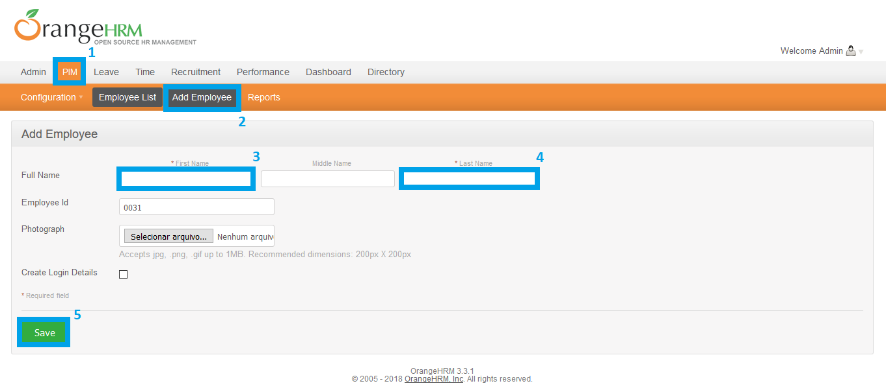

- **Classe: MenuPIMTestCase**

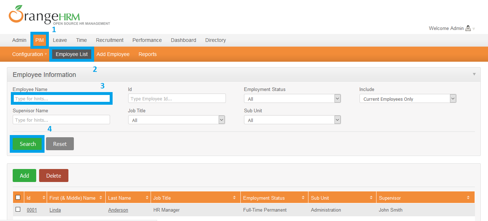

- **Classe: MenuAdminTestCase**

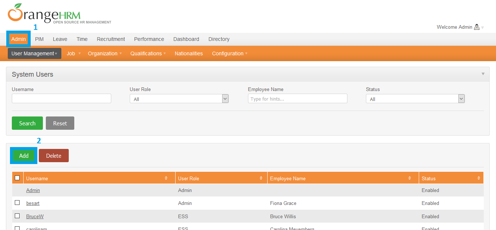

- **Classe: MenuAdminTestCase**

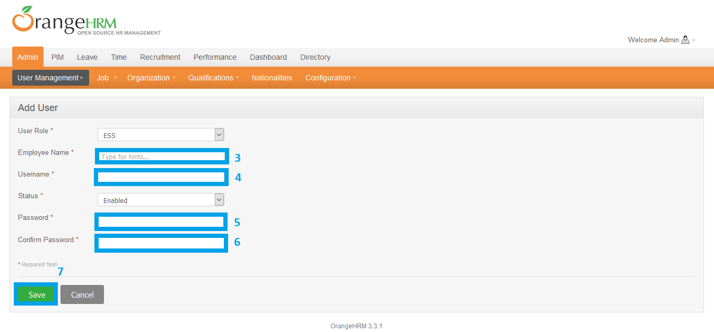

- **Classe: MenuLeaveTestCase**

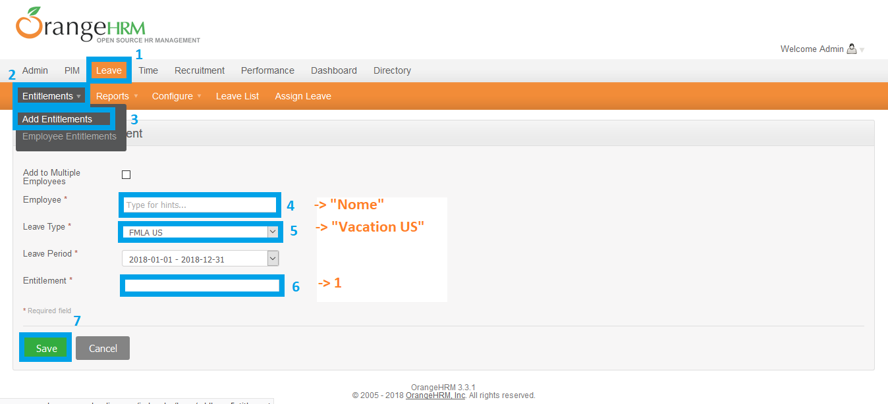

- **Classe: MenuLeaveTestCase**

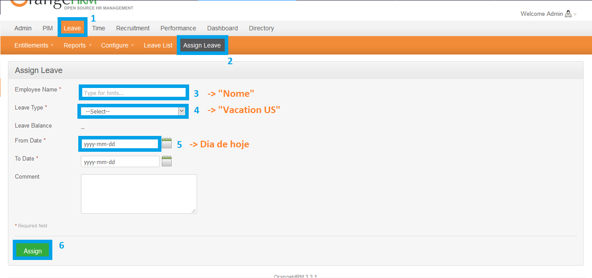

- **Classe: MenuTimeTestCase**

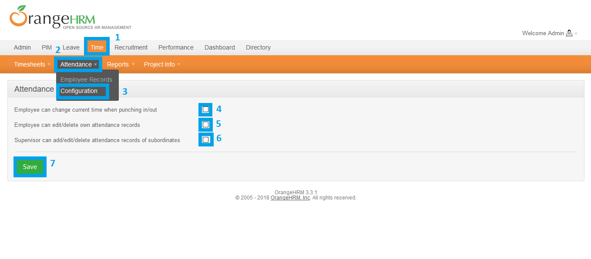

- **Classe: MenuDirectoryTestCase**

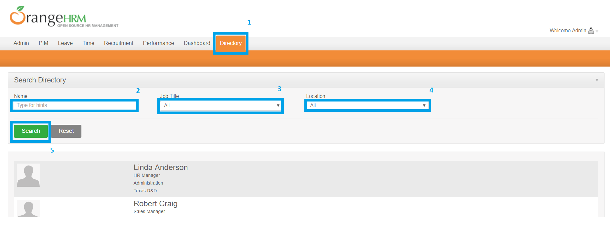

- **Classe: MenuRecruitmentTestCase**

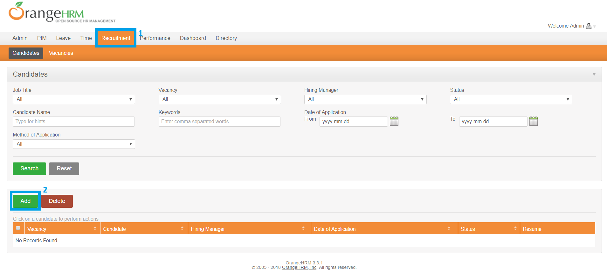

- **Classe: MenuRecruitmentTestCase**

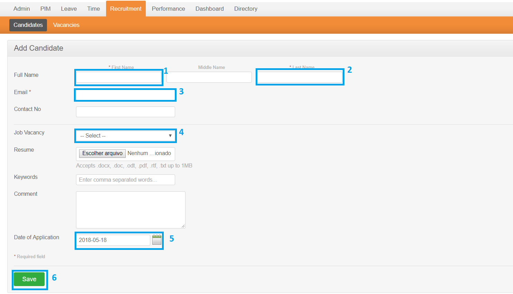

- **Classe: MenuRecruitmentTestCase**

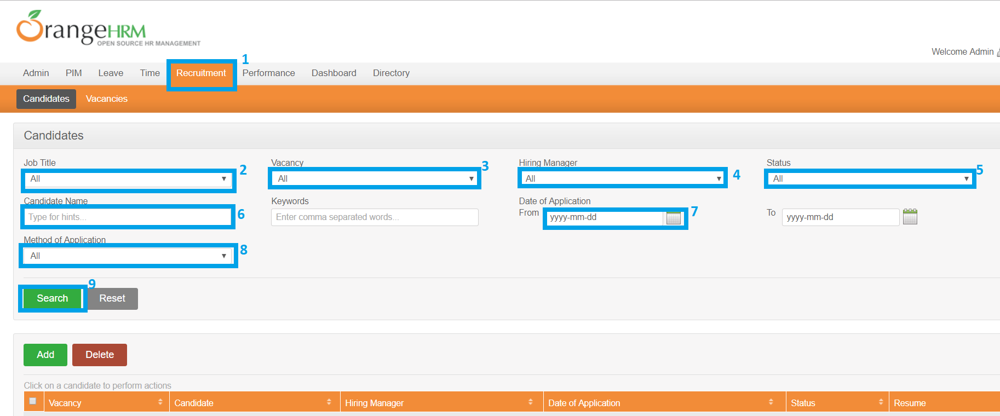
